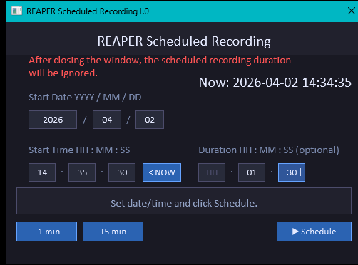
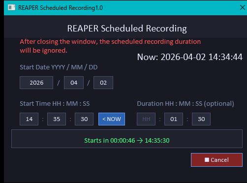
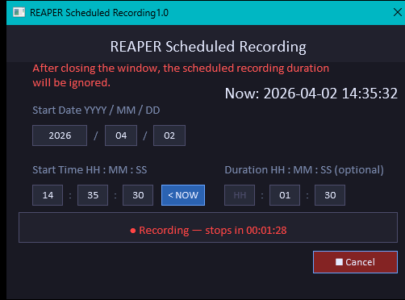
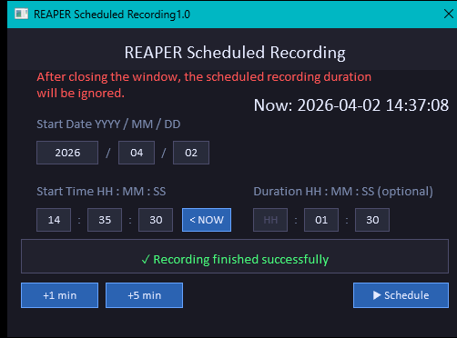

# Reaper Scheduled Recorging
_REAPER action for scheduled recording._

> v1.00 2026-04-02 Initial release

## Installation

- Open Reaper resource folder (Options / Show Reaper resource path in explorer/finder..."
- Copy `Scheduled Recording.lua` to Scripts folder.
- Actions / Show actions list... / New action... / Load ReaScript... / open `Scheduled Recording.lua`

## Using
- Arm some tracks for recording.

- Double click "Script: Scheduled Recording.lua" in the Actions list, or map a key action.

 

 

- Set recording **start** date and time. Scroll values up/down or enter digits.

- Set **duration** of the recording if you need to stop recording at the specific time automatically.
  Blank or zero duration does not limit recording time, and you have to stop recording manually.

> [!WARNING]
> Do not close Scheduled Recording windows if you need to stop recording at the specific time automatically.
  After closing window, the scheduled recording duration will be ignored, and you have to stop recording manually.

- Click "Schedule".
